# SC-500 Lab 05 — AI Security Posture & Threat Protection with Microsoft Defender for Cloud

<p align="center">
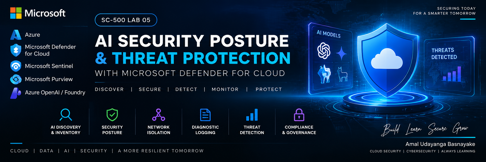
</p>

<p align="center"><b>Engineer-level Azure AI security posture, network isolation, identity hardening, diagnostic logging and AI resource discovery.</b></p>

<p align="center">


</p>

---

## 📌 Repository

**Repository name**
```text
SC-500-Lab-05-AI-Security-Posture-Threat-Protection-Microsoft-Defender-for-Cloud
```

**GitHub description**
```text
Engineer-level SC-500 lab demonstrating AI security posture management with Microsoft Defender for Cloud, Microsoft Foundry, Private Endpoint, Entra ID/RBAC, network isolation, diagnostic logging, Log Analytics, Cloud Security Explorer, and AI model discovery.
```

---

## 🖼️ Lab Visuals

<p align="center">
  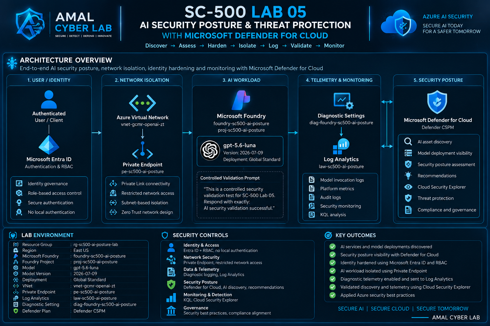
</p>

---

## 🎯 Executive Summary

This lab demonstrates how an Azure AI workload can be discovered, assessed and hardened using **Microsoft Defender for Cloud** and **Microsoft Foundry**.

The engineering workflow is:

> **Discover → Assess → Harden → Isolate → Log → Validate → Monitor**

AI security is treated as a complete cloud security system involving identity, network, AI platform, secrets, telemetry, detection and governance.

---

# 🧠 Security Architecture

<p align="center">
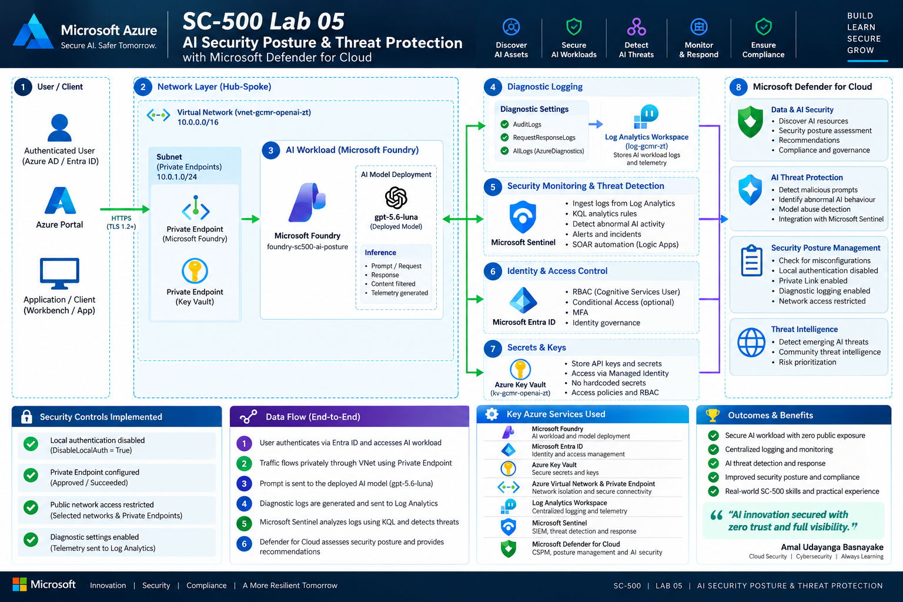
</p>

```text
Authenticated User / Client
          │
          ▼
    Microsoft Entra ID
          │
          │ RBAC
          ▼
 Azure Virtual Network
          │
   Private Endpoint
          │
          ▼
 Microsoft Foundry
          │
     gpt-5.6-luna
          │
          ├──────────► Diagnostic Settings
          │                   │
          │                   ▼
          │            Log Analytics
          │                   │
          │                   ▼
          │            Security Monitoring
          │
          ▼
 Microsoft Defender for Cloud
   ├─ AI Discovery
   ├─ Cloud Security Explorer
   ├─ Security Posture
   └─ Recommendations
```

---

# 🏗️ Lab Environment

| Component | Configuration |
|---|---|
| Resource Group | `rg-sc500-ai-posture-lab` |
| Region | East US |
| Microsoft Foundry | `foundry-sc500-ai-posture` |
| Foundry Project | `proj-sc500-ai-posture` |
| Model | `gpt-5.6-luna` |
| Model Version | `2026-07-09` |
| Deployment | Global Standard |
| VNet | `vnet-gcmr-openai-zt` |
| Subnet | `workload-subnet` |
| Private Endpoint | `pe-sc500-ai-posture` |
| Log Analytics | `law-sc500-ai-posture` |
| Diagnostic Setting | `diag-foundry-sc500-ai-posture` |
| Defender Plan | Defender CSPM |

---

# 🔐 Security Objectives

### 01 — AI Asset Discovery
Discover AI services, model deployments and relationships through Defender for Cloud.

### 02 — Security Posture
Use Defender CSPM to establish AI security posture visibility.

### 03 — Identity Hardening
Reduce dependence on local authentication and use Microsoft Entra ID + RBAC.

### 04 — Network Isolation
Protect the AI workload with Azure Private Link and restricted network access.

### 05 — Security Telemetry
Send Foundry diagnostic telemetry to Log Analytics.

### 06 — Operational Validation
Validate discovery and telemetry using Cloud Security Explorer and KQL.

---

# 🧪 Implementation

## Phase 01 — Defender CSPM

Defender CSPM was enabled to provide enhanced cloud security posture visibility.

## Phase 02 — Microsoft Foundry

Created:

```text
foundry-sc500-ai-posture
└── proj-sc500-ai-posture
```

inside:

```text
rg-sc500-ai-posture-lab
```

## Phase 03 — AI Model Deployment

Deployed:

```text
gpt-5.6-luna
Version: 2026-07-09
Deployment: Global Standard
```

Controlled validation prompt:

```text
This is a controlled security validation test for SC-500 Lab 05.
Respond with exactly:
AI security validation successful.
```

Observed response:

```text
AI security validation successful.
```

---

# 🔑 Identity & RBAC

The Foundry resource was configured for Entra ID-based access.

Role assigned at resource scope:

```text
Cognitive Services User
```

Security flow:

```text
Identity
   ↓
Microsoft Entra ID
   ↓
Azure RBAC
   ↓
Microsoft Foundry
```

---

# 🔒 Local Authentication Hardening

Local authentication was disabled:

```powershell
Set-AzCognitiveServicesAccount `
  -ResourceGroupName "rg-sc500-ai-posture-lab" `
  -Name "foundry-sc500-ai-posture" `
  -DisableLocalAuth $true
```

Validation:

```powershell
Get-AzCognitiveServicesAccount `
  -ResourceGroupName "rg-sc500-ai-posture-lab" `
  -Name "foundry-sc500-ai-posture"
```

Expected property:

```text
DisableLocalAuth : True
```

**Security objective:** reduce the attack surface associated with long-lived API keys and favor identity-based access.

---

# 🌐 Private Link & Network Isolation

Private Endpoint:

```text
pe-sc500-ai-posture
```

NIC:

```text
nic-pe-sc500-ai-posture
```

Target:

```text
foundry-sc500-ai-posture
Sub-resource: account
```

Network:

```text
vnet-gcmr-openai-zt
└── workload-subnet
```

Validation:

```text
Provisioning State: Succeeded
Connection State: Approved
```

Public network access was changed from:

```text
All networks
```

to:

```text
Selected Networks and Private Endpoints
```

Security model:

```text
Internet
   X
   │
Microsoft Foundry
   ▲
   │
Private Link
   │
Approved VNet
```

---

# 📊 Diagnostic Logging

Created:

```text
law-sc500-ai-posture
```

Diagnostic setting:

```text
diag-foundry-sc500-ai-posture
```

Enabled categories:

```text
Audit Logs
Request and Response Logs
Azure OpenAI Request Usage
AllMetrics
```

Destination:

```text
Log Analytics
```

Telemetry flow:

```text
Microsoft Foundry
      ↓
Diagnostic Settings
      ↓
Log Analytics
      ↓
KQL Analysis
      ↓
Security Monitoring
```

---

# 🔎 KQL Telemetry Validation

```kql
AzureDiagnostics
| where ResourceProvider == "MICROSOFT.COGNITIVESERVICES"
| where Resource == "FOUNDRY-SC500-AI-POSTURE"
| where Category == "RequestResponse"
| project
    TimeGenerated,
    ResponseCode = ResultSignature,
    DurationMs,
    OperationName,
    CorrelationId
| order by TimeGenerated desc
| take 50
```

Telemetry ingestion was successfully observed in `AzureDiagnostics`.

Observed operation:

```text
Projects_Wildcard_Get
```

Observed response:

```text
403
```

A `403` was treated as an observed response code, **not automatically as malicious activity**. The event was a management/project access operation rather than proof of malicious model inference.

---

# 📈 Latency Analysis

```kql
AzureDiagnostics
| where ResourceProvider == "MICROSOFT.COGNITIVESERVICES"
| where Resource == "FOUNDRY-SC500-AI-POSTURE"
| where Category == "RequestResponse"
| project TimeGenerated,
          ResponseCode=ResultSignature,
          DurationMs,
          OperationName
| summarize
    RequestCount=count(),
    P50=percentile(DurationMs,50),
    P90=percentile(DurationMs,90),
    P95=percentile(DurationMs,95),
    P99=percentile(DurationMs,99)
    by ResponseCode, OperationName
| order by RequestCount desc
```

This demonstrates how AI telemetry can support operational monitoring and investigation.

---

# 🤖 AI Discovery Results

Microsoft Defender for Cloud Data & AI Security reported:

```text
Total AI-related resources: 8
AI services: 5
Containers: 0
Data sets: 0
Models & endpoints: 3
```

---

# 🔍 Cloud Security Explorer

The AI workload/model query successfully discovered:

```text
gpt-5-mini
gpt-5.6-luna
text-embedding-3-large
```

Relationship:

```text
AI Model
   │
   └── Runs on
          │
          ▼
    Microsoft Foundry
```

This demonstrates visibility into the AI estate beyond simple resource enumeration.

---

# 🛡️ Security Controls Implemented

```text
✅ Defender CSPM enabled
✅ Microsoft Foundry AI workload deployed
✅ Microsoft Entra ID / RBAC configured
✅ Cognitive Services User assigned
✅ Local authentication disabled
✅ Private Endpoint configured
✅ Private Endpoint approved
✅ Public network access restricted
✅ Diagnostic settings enabled
✅ Log Analytics centralized logging
✅ Request/Response telemetry validated
✅ AI resource discovery validated
✅ AI model discovery validated
✅ Cloud Security Explorer validated
```

---

# 🧭 Security Layers

```text
01 Identity
   Microsoft Entra ID + RBAC

02 AI Workload
   Microsoft Foundry + Model Deployment

03 Network
   VNet + Private Endpoint + Restricted Access

04 Authentication
   Local Authentication Disabled

05 Telemetry
   Diagnostic Settings + Log Analytics

06 Detection
   KQL / Security Monitoring Ready

07 Posture
   Defender CSPM + AI Security Visibility
```

---

# ⚠️ Defender Recommendation Assessment State

At final validation, Defender for Cloud still displayed four Foundry recommendations as `Unhealthy` / `Not evaluated`.

The recommendations were:

1. Diagnostic logs should be enabled
2. Key access should be disabled
3. Network access should be restricted
4. Azure Private Link should be used

The underlying Azure configurations were independently validated:

```text
DisableLocalAuth = True                ✅
Private Endpoint = Approved/Succeeded  ✅
Network Access = Restricted            ✅
Diagnostic Setting = Configured        ✅
AzureDiagnostics telemetry = Received ✅
```

Therefore, the Defender recommendation display was treated as an **assessment/evaluation timing state**, not as proof that the implemented Azure controls had failed.

No unnecessary repeated remediation was performed.

---

# 📁 Repository Structure

```text
SC-500-Lab-05-AI-Security-Posture-Threat-Protection-Microsoft-Defender-for-Cloud/
│
├── README.md
│
├── Architecture/
│   ├── sc500-lab-05-banner.png
│   └── architecture-diagram.png
│
├── Evidence/
│   ├── 01-...
│   ├── ...
│   └── 78-defender-foundry-resource-health-final.png
│
└── KQL/
    └── foundry-request-response-telemetry.kql
```

---

# 🧪 Evidence Map

| Evidence | Purpose |
|---|---|
| 01–11 | Defender baseline |
| 12–13 | Defender CSPM |
| 14–19 | Foundry + AI discovery |
| 20–24 | Model discovery/deployment/inference |
| 25–29 | Inventory + RBAC |
| 30–38 | Authentication + posture + network |
| 39–50 | Private Endpoint + network restriction |
| 51–57 | Diagnostic logging |
| 58–69 | Log Analytics + telemetry |
| 70–71 | Post-remediation state |
| 72–75 | Final AI security visibility |
| 76–78 | Defender recommendation/resource health |

> Redact subscription IDs, tenant identifiers, keys, tokens and other sensitive metadata before publishing screenshots publicly.

---


---

# 📸 Evidence Gallery

> **Visual evidence is intentionally embedded below** so the GitHub README itself shows the key implementation results. The complete screenshot archive remains under `Evidence/`.

## AI Security Posture — Final Overview

<p align="center">
  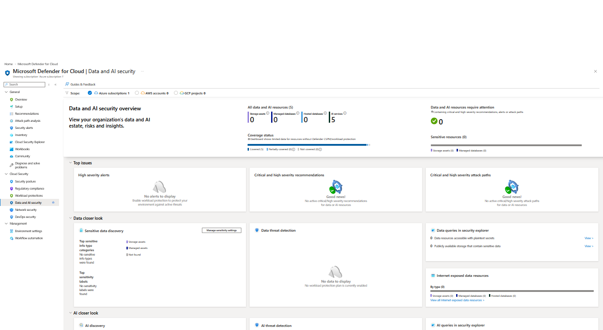
</p>

**Evidence 72 — Data & AI Security:** 8 AI-related resources, 5 AI services, 3 models/endpoints, and 0 data/AI resources requiring attention.

---

## AI Workload Discovery

<p align="center">
  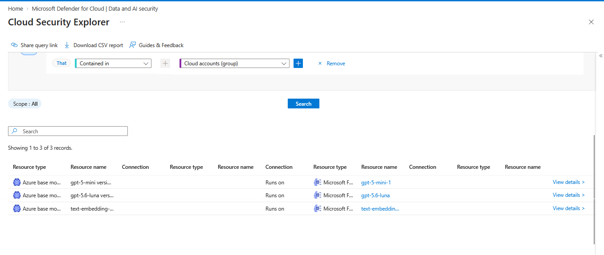
</p>

**Evidence 73 — Cloud Security Explorer:** AI model relationships discovered inside the Azure environment.

---

## AI Models & Endpoints

<p align="center">
  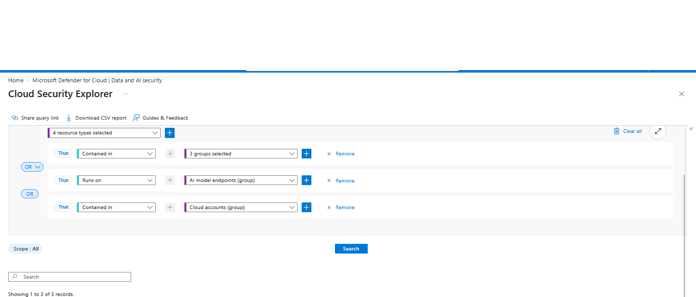
</p>

**Evidence 74 — Model discovery:** `gpt-5-mini`, `gpt-5.6-luna`, and `text-embedding-3-large` discovered running on Microsoft Foundry.

---

## Final Data & AI Security Overview

<p align="center">
  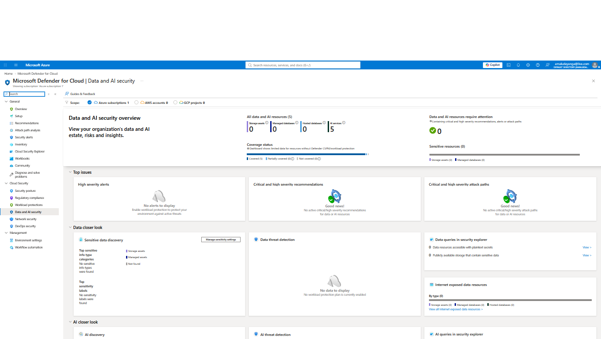
</p>

**Evidence 75 — Final overview:** Defender for Cloud reports 5 AI services and 8 AI-related resources.

---

## Defender Recommendation Assessment State

<p align="center">
  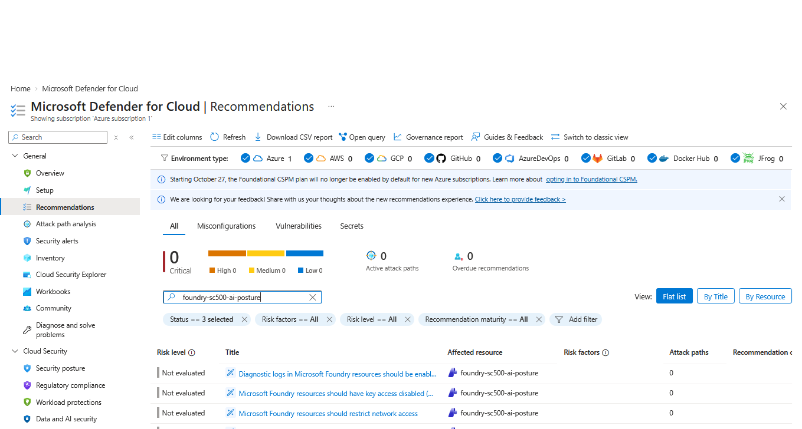
</p>

**Evidence 76 — Assessment state:** the four Foundry recommendations remained `Not evaluated` in the Defender assessment view after the underlying Azure controls had already been independently validated.

---

## Defender AI Resource Inventory

<p align="center">
  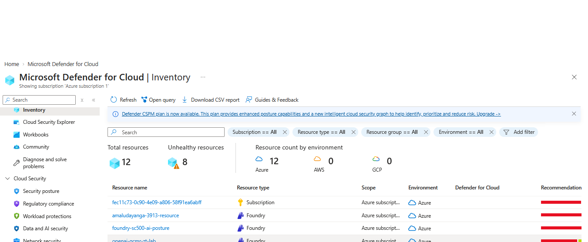
</p>

**Evidence 77 — Inventory:** Foundry resources and supporting Azure security resources are visible in Defender for Cloud.

---

## Foundry Resource Health — Final Check

<p align="center">
  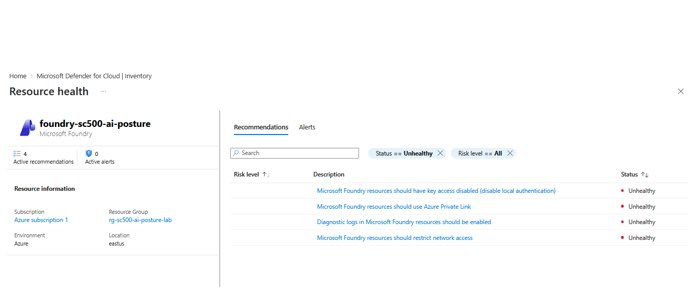
</p>

**Evidence 78 — Resource Health:** the four Foundry security recommendations are shown against the exact lab resource.

---

## Selected Implementation Evidence

### Resource Group

<p align="center">
  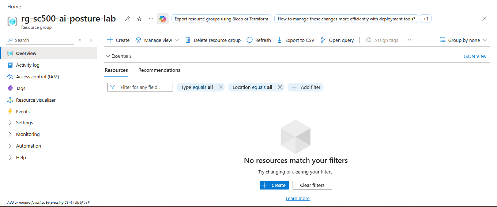
</p>

### Defender CSPM

<p align="center">
  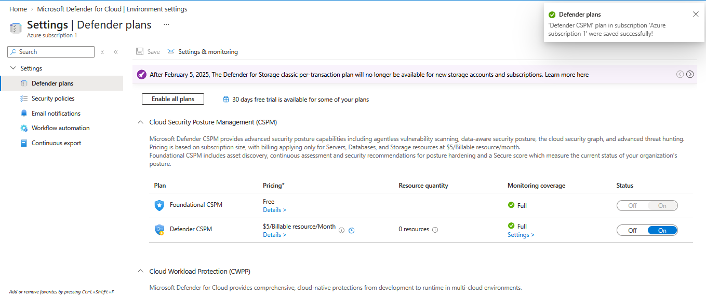
</p>

### Microsoft Foundry Resource

<p align="center">
  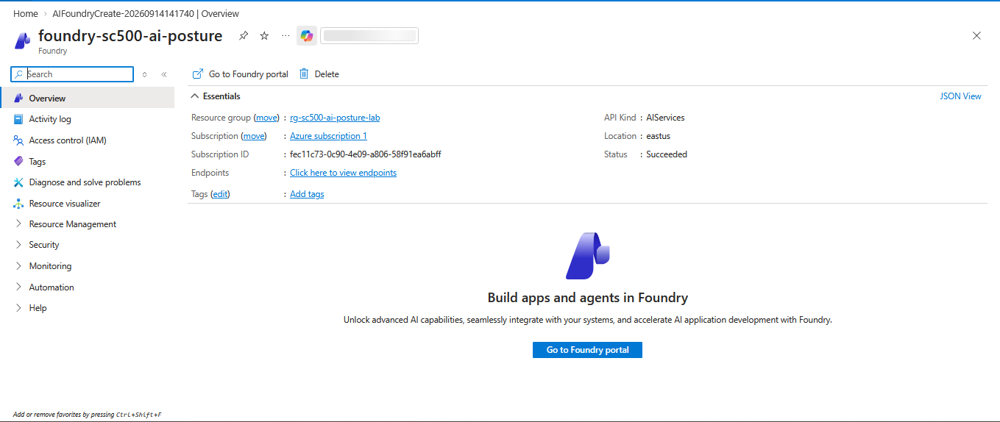
</p>

### Cloud Security Explorer Query

<p align="center">
  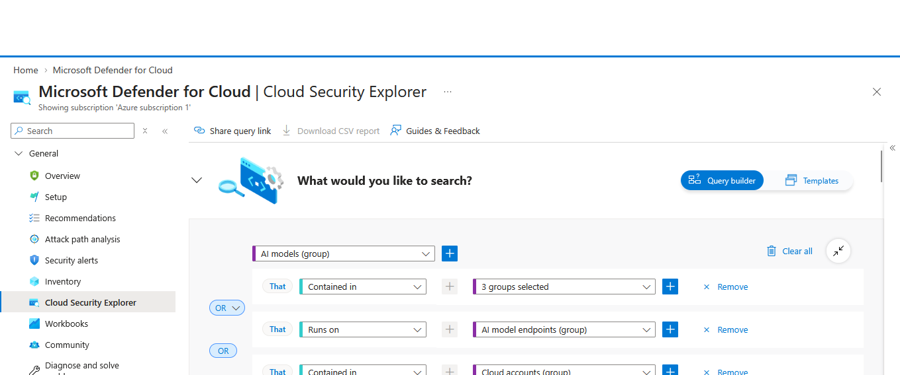
</p>

### GPT-5.6-Luna Model

<p align="center">
  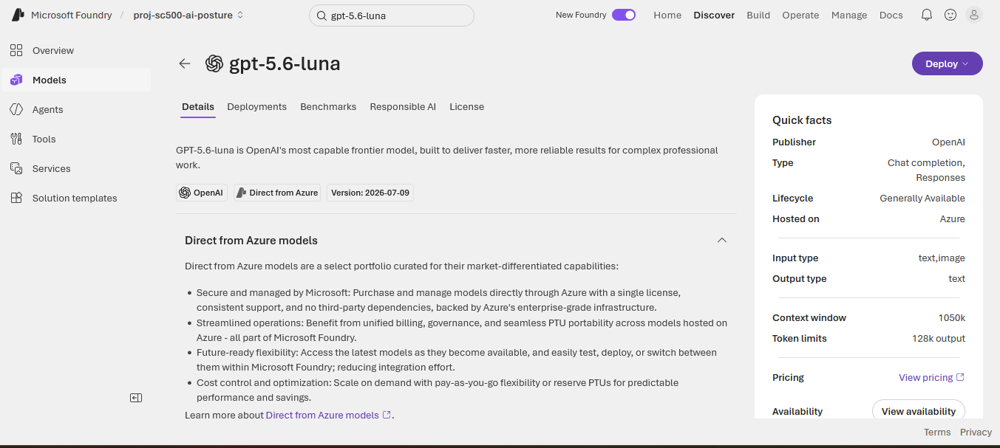
</p>

### Foundry Playground

<p align="center">
  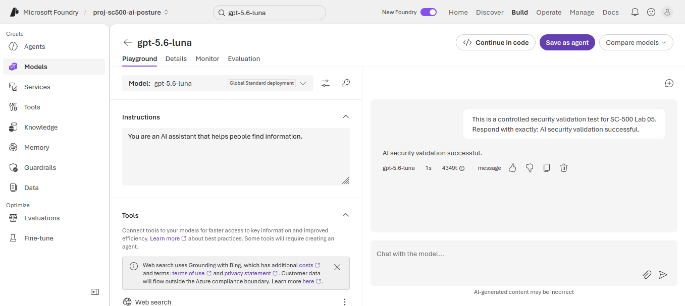
</p>

---

# 🧠 Engineering Lessons

### AI security is cloud security

An AI model depends on:

```text
Identity
+ Network
+ AI Platform
+ Data
+ Secrets
+ Telemetry
+ Detection
+ Governance
```

### Zero Trust applies to AI

```text
Never trust by default
        ↓
Verify identity
        ↓
Least privilege
        ↓
Restrict network paths
        ↓
Monitor activity
        ↓
Continuously assess posture
```

### Telemetry requires context

A security engineer should investigate:

```text
Who?
What operation?
From where?
When?
Expected?
Response code?
Repeated?
Related authentication?
Related inference?
```

> **Logs are evidence. Context determines whether evidence represents a threat.**

---

# 🎓 SC-500 / Engineer Thinking

This lab connects:

```text
Identity
   ↓
AI Security
   ↓
Network Security
   ↓
Security Posture
   ↓
Logging & Monitoring
   ↓
Threat Detection
   ↓
Governance
```

The objective is not to memorize isolated Azure services.

The objective is to understand **how security controls work together as one architecture**.

---

# 🚀 Future Enhancements

Potential next-stage extensions:

- Microsoft Defender for AI Services
- Microsoft Sentinel integration
- Logic Apps SOAR automation
- AI prompt-injection detection
- AI model abuse detection
- Threat intelligence enrichment
- Microsoft Purview data protection
- AI-specific analytics rules
- Continuous posture monitoring

These are intentionally listed as future enhancements and are not claimed as completed in this lab.

---

# 💰 Cost & Cleanup

Potential billable components include:

```text
Defender CSPM
Microsoft Foundry / model usage
Private Endpoint
Log Analytics ingestion / retention
```

After evidence collection:

1. Publish the repository.
2. Verify no secrets are exposed.
3. Confirm screenshots are redacted.
4. Remove lab resources if they are no longer required.

---

# 🔐 Public GitHub Checklist

```text
[ ] No API keys
[ ] No passwords
[ ] No access tokens
[ ] No connection strings
[ ] No private certificates
[ ] No subscription IDs in screenshots
[ ] No tenant-sensitive identifiers
[ ] No credentials in KQL
```

---

# 🏆 Final Outcome

The lab demonstrates an engineer-level approach to securing an Azure AI workload:

```text
DISCOVER
   ↓
AI Inventory
   ↓
ASSESS
   ↓
Defender CSPM
   ↓
HARDEN
   ↓
Identity + RBAC + Local Auth Disabled
   ↓
ISOLATE
   ↓
Private Endpoint + Restricted Network
   ↓
LOG
   ↓
Diagnostic Settings + Log Analytics
   ↓
VALIDATE
   ↓
Cloud Security Explorer + KQL
   ↓
MONITOR
   ↓
Security Operations Readiness
```

> **Secure the AI workload as a complete cloud system — not just the model.**

---

## 👨‍💻 Author

**Amal Udayanga Basnayake**

Cloud Security | Cybersecurity | Azure Security | AI Security

**Build • Learn • Secure • Grow**

---

<p align="center">
<b>SC-500 Lab 05</b><br>
AI Security Posture & Threat Protection<br>
<i>Microsoft Defender for Cloud + Microsoft Foundry</i>
</p>
